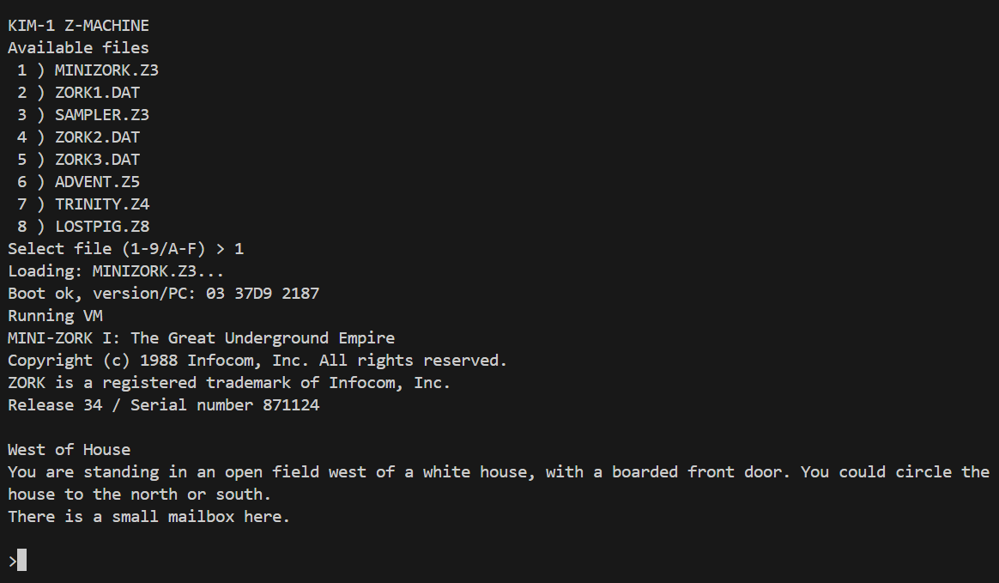

# KIM-1 Z-Machine

This project is a Z-machine-capable runtime for the KIM-1.



## Overview

This project ports a Z-machine-capable runtime to the KIM-1, building on the storage infrastructure developed during the KIM-1 Adventure project. Game data loads from SD card storage using integrated SD/FAT32 libraries.

## Project Goal

Build a practical Z-machine implementation for KIM-1-class hardware, in staged milestones, using the existing storage stack (SD + FAT32) as the foundation.

## Status

Currently in active development:

- SD + FAT32 support libraries from the Adventure project are integrated.
- Loader functionality is maintained in `sdcard6502/src/loadfile.s` (upstream shared source).
- `src/zmachine.s` now includes:
  - SD/FAT32 initialization
  - playable file menu scan (`.Z1/.Z2/.Z3/.Z4/.Z5/.Z8/.DAT`)
  - story selection by menu index
  - story boot/header parse (version + initial PC)
  - dynamic-memory preload (`0 .. static_base-1`) into RAM
  - stack/global/local variable foundations and call-frame scaffolding
  - minimal VM fetch/decode loop with early 0OP support
  - inline Z-string decoding for `print`/`print_ret` text paths

## Roadmap

1. Keep hardening the loader path (file open/read/copy to memory from FAT32).
2. Establish a minimal Z-machine execution core (header parsing + fetch/decode/dispatch).
3. Implement core opcode subset for early Infocom-style stories.
4. Add object table/property handling and dictionary/token parsing.
5. Add save/restore strategy appropriate for KIM-1 memory limits.
6. Iterate toward compatibility and performance.

## Repository Layout

- `src/Makefile` - build rules
- `src/zmachine.s` - main bring-up target: menu/select/boot + VM scaffold
- `sdcard6502/src/loadfile.s` - interactive loader (SD/FAT32 init, prompt, file load-to-memory)
- `sdcard6502/src/libsd.s` - low-level SD card SPI routines (shared source)
- `sdcard6502/src/libfat32.s` - FAT32 directory/file routines (shared source)
- `sdcard6502/src/libio.s` - simple console I/O helpers (shared source)
- `sdcard6502/src/hwconfig.s` - KIM-1/VIA addresses and hardware constants (shared source)

## Prerequisites

- `ca65` and `ld65` from the [cc65 toolchain](https://cc65.github.io/)
- `srec_cat` from [SRecord](http://srecord.sourceforge.net/)
- KIM-1 linker config file (`kim1-60k.cfg`) available to `ld65`

## Build

From the `src` directory:

```bash
make
```

This produces:

- `zmachine.bin` - raw binary
- `zmachine.ptp` - MOS Technology paper-tape format (offset at `$A000`)
- map/listing/object intermediates

Clean build outputs:

```bash
make clean
```

The VM loop is still intentionally incomplete, but now includes:

- 0OP handling for `RTRUE`, `RFALSE`, `PRINT`, `PRINT_RET`, `NEW_LINE`, `NOP`, `QUIT`
- Additional 0OP control support (`SAVE`/`RESTORE` branch stubs, `RESTART`, `RET_POPPED`, `POP`, `VERIFY`)
- VAR `CALL` (`0xE0`) operand decode path with routine invocation scaffolding
- VAR 2OP form decoding (`C0..DF`) and extra call forms (`CALL_2S`, `CALL_2N`, `CALL_VS2`, `CALL_VN`, `CALL_VN2`)
- Early short-form 1OP handling (`JZ`, `RET`, `JUMP`, `LOAD`) with branch parsing
- Additional 1OP object handling (`GET_SIBLING`, `GET_CHILD`, `GET_PARENT`, `REMOVE_OBJ`)
- More 1OP support (`INC`, `DEC`, `PRINT_ADDR`, `CALL_1S`)
- Broader 2OP handling: compares/branches, arithmetic, memory/property access (`GET_PROP`, `GET_PROP_ADDR`, `GET_NEXT_PROP`) and object ops (`JIN`, `TEST_ATTR`, `SET_ATTR`, `CLEAR_ATTR`, `INSERT_OBJ`)
- Additional 1OP utilities (`GET_PROP_LEN`, `PRINT_OBJ`, `PRINT_PADDR`)
- VAR utility ops (`STOREW`, `STOREB`, `PUT_PROP`, `SREAD` with multi-token parse-buffer output + dictionary lookup, `PRINT_CHAR`, `PRINT_NUM`, `RANDOM`, `PUSH`, `PULL`)
- 32-step trace mode (`T`) to accelerate opcode bring-up (`PC:OP`)

**Important current limitation**: The standard opcode tables are now mapped, but later-version window/picture/mouse/menu/user-stack behavior is still compatibility-only on this hardware target.

## Notes

- The active Makefile target is `zmachine.s`
- Loader builds/tests should be run from `sdcard6502/src`
- SD wiring assumptions are defined in `sdcard6502/src/hwconfig.s` (`SD_CS`, `SD_SCK`, `SD_MOSI`, `SD_MISO` on VIA Port A bits)
- Z-machine execution is still under active development; full gameplay compatibility is not yet implemented

## Credits

This project was developed with contributions from:

- **Ryan Roth** – Project lead and primary implementation
- **Claude** – Code assistance and architecture guidance
- **Codex** – Code generation and implementation support
